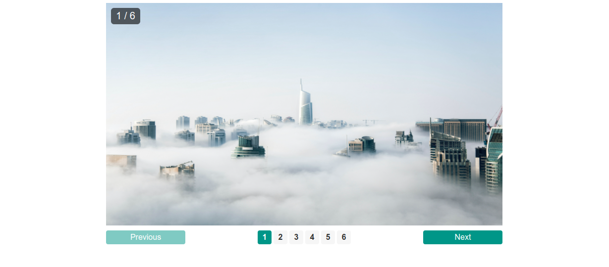
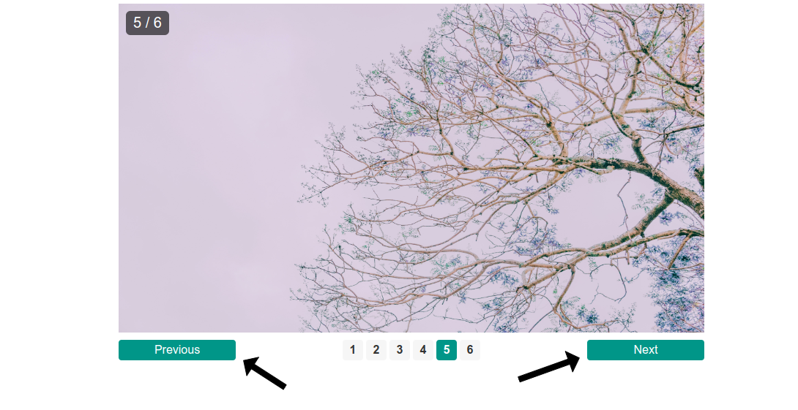
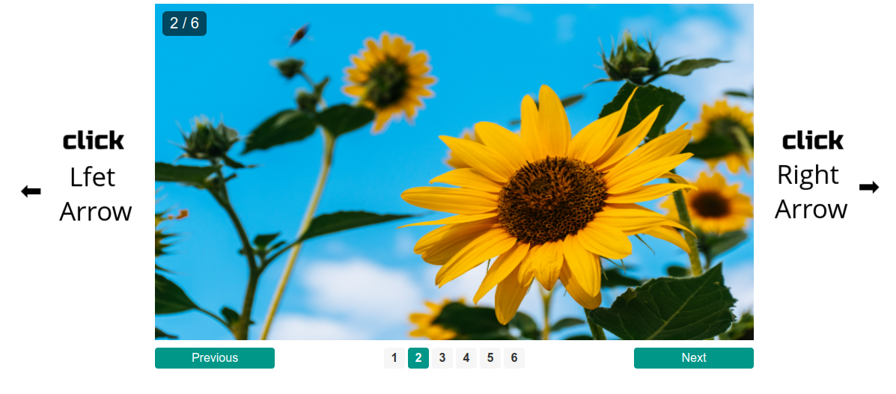
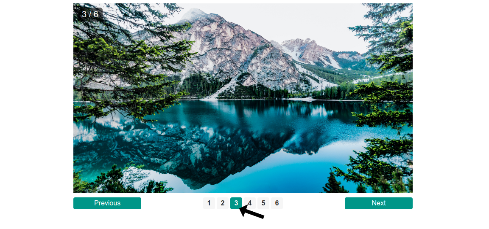

# ImageSlider

## Screenshots

 
 
 
 

## How to use

- Click on "Previous" or "Next" buttons
- Use the "left" or "right" arrows on the keyboard
- Click on the number of wanted image

## Used tools

- HTML
- CSS
- JAVASCRIPT

## Demo
<a href="https://omarsha6an.github.io/ImageSlider/">Click here</a>
